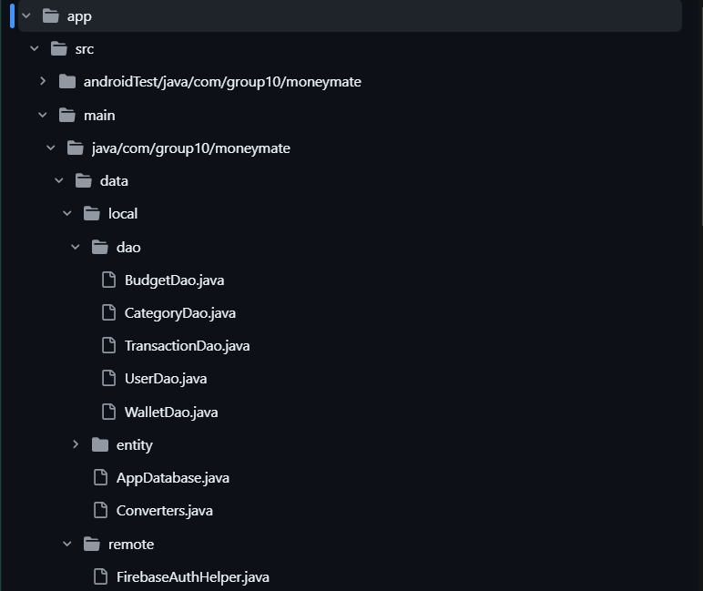
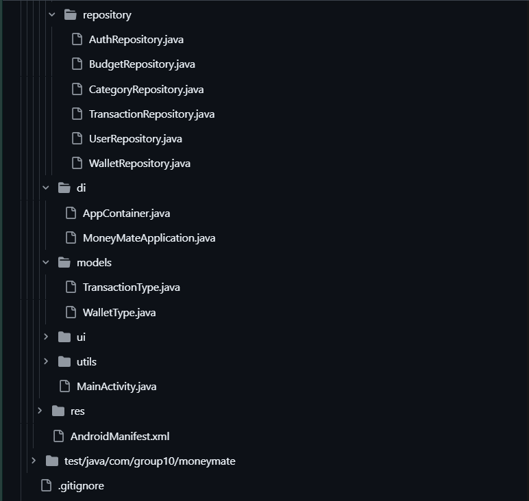
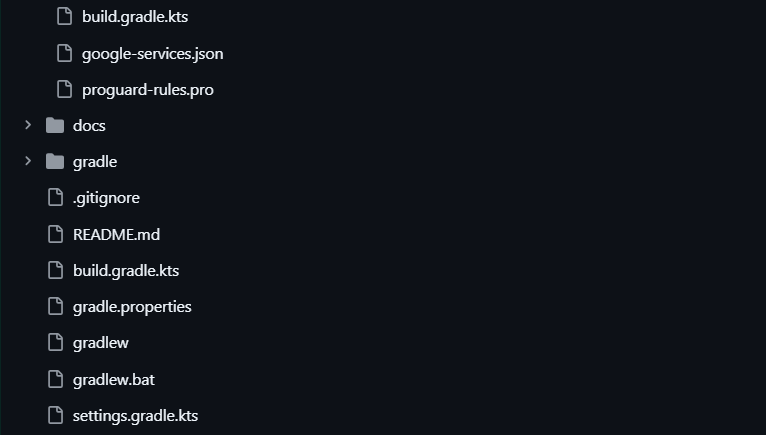

# BÁO CÁO TIẾN ĐỘ TUẦN

## I. Thông Tin Chung

| Thông tin       | Chi tiết             |
|-----------------|----------------------|
| **Mã nhóm**     | 10                   |
| **Tên nhóm**    | 10                   |
| **Tên dự án**   | MoneyMate            |
| **Thời gian**   | 02/03/2026 - 07/03/2026 |

---

## II. Công Việc Đã Hoàn Thành Trong Tuần

<!-- **Lưu ý:** Mỗi công việc chỉ nên do một hoặc hai thành viên thực hiện. Mỗi dòng 1 task -->

### 23127472 – Phạm Ngọc Thái

*Không có công việc trong tuần*

---

### 23127499 – Lê Huy Toàn
- Set up project, tạo cấu trúc thư mục, và thiết lập môi trường phát triển với AI(Copilot).
- Đảm bảo các file setup không bị xung đột và có thể build thành công.
- Điều chỉnh và tối ưu để project không bị quá phức tạp.

- Cấu trúc project:

---

### 23127510 – Phùng Ngọc Tuấn

*Không có công việc trong tuần*

---

## III. Khai Báo Sử Dụng AI

- **Lê Huy Toàn**: Sử dụng AI (Copilot) để hỗ trợ viết code, tạo cấu trúc dự án, và tối ưu hóa quy trình phát triển. AI đã giúp giảm thời gian setup và đảm bảo code được viết theo chuẩn mực.
  + Claude, Opus 4.6, truy cập lúc 9:24 AM ngày 04/03/2026, prompt: "<nội dung mô tả các chức năng (đã soạn trước)> Hãy setup cấu trúc cho sự án này", sử dụng để thiết lập cấu trúc dự án ban đầu, tạo các thư mục và file cần thiết cho việc phát triển ứng dụng quản lý chi tiêu.
  + Claude, Opus 4.6, truy cập lúc 10:05 AM ngày 04/03/2026, prompt: "Điều chỉnh để cấu trúc bớt phức tạp hơn, bỏ các file chưa cần thiết cho hiện tại và có thể cho thêm sau này", sử dụng để tối ưu hóa cấu trúc dự án, loại bỏ các file không cần thiết và đảm bảo rằng cấu trúc dự án phù hợp với quy trình phát triển hiện tại.
  + Claude, Sonnet 4.6, truy cập lúc 10:27 AM ngày 04/03/2026, prompt: "Sửa các lỗi đang có trong project" sử dụng để hỗ trợ sửa các lỗi phát sinh trong quá trình generate code, đảm bảo rằng project có thể build thành công.
---

## IV. Kế Hoạch Công Việc Tuần Tới

- Thiết lập toàn bộ các Entity Room và Database class.
- Đăng ký/Đăng nhập bằng Firebase. Thiết lập màn hình Splash để kiểm tra trạng thái đăng nhập.
- Tạo bộ danh mục mặc định, icon và màu sắc. Xây dựng màn hình quản lý Danh mục.
- Xây dựng màn hình tạo ví, chọn loại ví (CASH, BANK...).
- Thiết kế UI/UX tổng thể cho cả nhóm (Figma/Sketch) để thống nhất màu sắc, font chữ.
- Thực hiện Nhóm 10 (Thông báo): Cấu hình Notification Channel. Viết logic nhắc nhở người dùng nhập chi tiêu hàng ngày.
  
---

## V. Các Vấn Đề Phát Sinh

*Không có vấn đề phát sinh trong tuần.*
