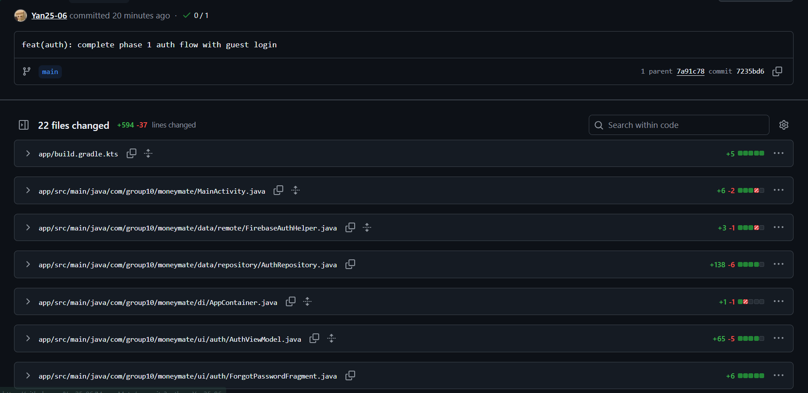
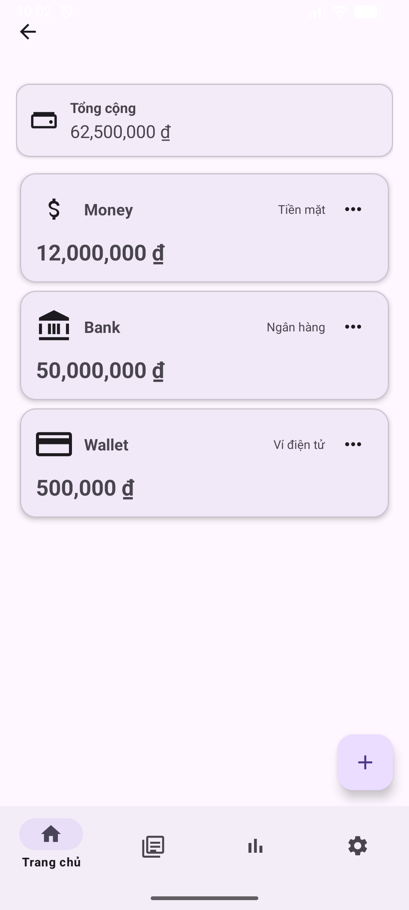

# BÁO CÁO TIẾN ĐỘ TUẦN

## I. Thông Tin Chung

| Thông tin       | Chi tiết                |
|-----------------|-------------------------|
| **Mã nhóm**     | 10                      |
| **Tên nhóm**    | 10                      |
| **Tên dự án**   | MoneyMate               |
| **Thời gian**   | 09/03/2026 - 14/03/2026 |

---

## II. Công Việc Đã Hoàn Thành Trong Tuần

### 23127472 – Phạm Ngọc Thái

*Không có công việc trong tuần*

---

### 23127499 – Lê Huy Toàn
- Hoàn thành Phase 1 Authentication: đăng ký, đăng nhập email/password, và đăng nhập ẩn danh (guest).
- Xây dựng MVVM architecture cho auth flow (ViewModel, Repository, Fragment).
- Implement auto-redirect khi đăng nhập thành công, clean back stack để không quay lại login.

**Minh chứng:**

---

### 23127510 – Phùng Ngọc Tuấn

- Thực hiện chức năng thêm, xóa, sửa ví (wallet) trong ứng dụng.

**Minh chứng:**

---

## III. Khai Báo Sử Dụng AI

- **Lê Huy Toàn**: Sử dụng AI (Copilot) để hỗ trợ viết code, tạo cấu trúc dự án, và tối ưu hóa quy trình phát triển. AI đã giúp giảm thời gian setup và đảm bảo code được viết theo chuẩn mực.
    + Claude, Sonnet 4.6, truy cập lúc 8:34 PM ngày 14/03/2026, prompt: "Thêm phần đăng nhập ẩn danh (guest login) vào flow đăng nhập hiện tại", sử dụng để mở rộng chức năng đăng nhập, cho phép người dùng truy cập ứng dụng mà không cần đăng ký tài khoản, giúp tăng khả năng tiếp cận và trải nghiệm người dùng.

- **Phùng Ngọc Tuấn**: Sử dụng AI (Copilot) để hỗ trợ viết code cho chức năng quản lý ví, bao gồm thêm, xóa, và sửa ví. AI đã giúp tối ưu hóa logic xử lý và đảm bảo code được viết hiệu quả và dễ bảo trì.
    + ChatGPT, GPT-5.3-Codex, truy cập lúc 19:05 ngày 14/03/2026, prompt: "Cài đặt chức năng thêm ví mới trong ứng dụng quản lý tài chính theo tài liệu đính kèm, sử dụng style Material Design 3", sử dụng để tạo ra chức năng thêm ví mới, giúp người dùng dễ dàng quản lý tài chính cá nhân bằng cách tạo các ví khác nhau cho các mục đích chi tiêu khác nhau.

---

## IV. Kế Hoạch Công Việc Tuần Tới
- Hoàn thành cài đặt Quản lí Ví
- Hoàn thành cài đặt Quản lý Danh mục
- Hoàn thành cài đặt Quản lý Giao dịch

---

## V. Các Vấn Đề Phát Sinh

- Login với email/password (firebase) chưa được hoàn thiện.
- UI chưa được đẹp, cần cải thiện trải nghiệm người dùng.
