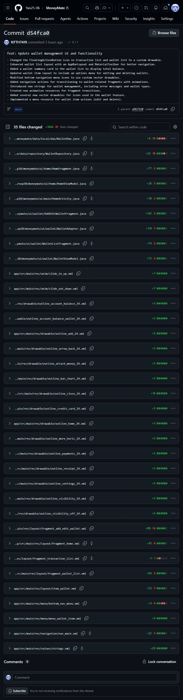

# BÁO CÁO TIẾN ĐỘ TUẦN

## I. Thông Tin Chung

| Thông tin       | Chi tiết                |
|-----------------|-------------------------|
| **Mã nhóm**     | 10                      |
| **Tên nhóm**    | 10                      |
| **Tên dự án**   | MoneyMate               |
| **Thời gian**   | 16/03/2026 - 21/03/2026 |

---

## II. Công Việc Đã Hoàn Thành Trong Tuần

### 23127472 – Phạm Ngọc Thái
*Chưa thực hiện công việc trong tuần*

---

### 23127499 – Lê Huy Toàn

**Minh chứng:**

---

### 23127510 – Phùng Ngọc Tuấn

- Hoàn thành chức năng quản lý ví, bao gồm thêm, xóa, và sửa ví. Người dùng có thể dễ dàng quản lý tài chính cá nhân bằng cách tạo các ví khác nhau cho các mục đích chi tiêu khác nhau.
- Thêm các Material Icon vào ứng dụng.

**Minh chứng:**

---

## III. Khai Báo Sử Dụng AI

- **Phùng Ngọc Tuấn**: Sử dụng AI (Copilot) để hỗ trợ chỉnh sửa giao diện cho chức năng quản lý ví.
    + ChatGPT, GPT-5.3-Codex, truy cập lúc 16:30 ngày 21/03/2026, prompt: "Khi ấn vào nút + để thêm ví trong màn hình danh sách ví thì có một màn hình thêm ví trồi lên che lấp toàn màn hình (kể cả thanh nav bar) có title và nút X để hủy việc thêm ví. Hãy sửa fragment thêm sửa ví để làm việc đó.", sử dụng để cải thiện UX mượt mà hơn.

---

## IV. Kế Hoạch Công Việc Tuần Tới
- Hoàn thành cài đặt Quản lý Danh mục
- Hoàn thành cài đặt Quản lý Giao dịch
- Hoàn thành xây dựng trang Home
- Thực hiện phần Quản lí tài khoản

---

## V. Các Vấn Đề Phát Sinh

- Các thành viên còn bận với deadline của các môn khác nên chưa thể tập trung hoàn toàn vào dự án, dẫn đến tiến độ có phần chậm hơn so với kế hoạch ban đầu.