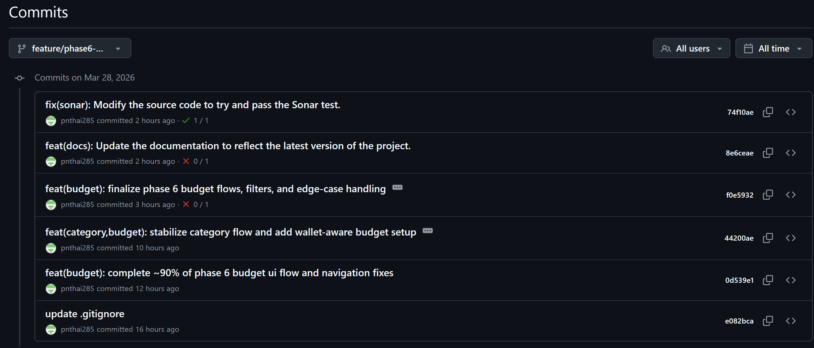
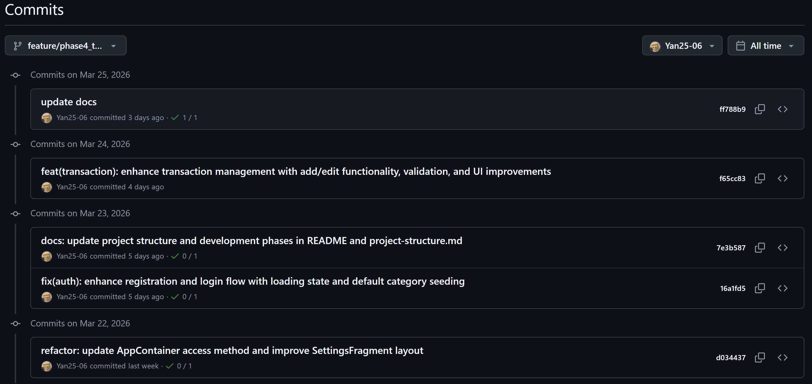
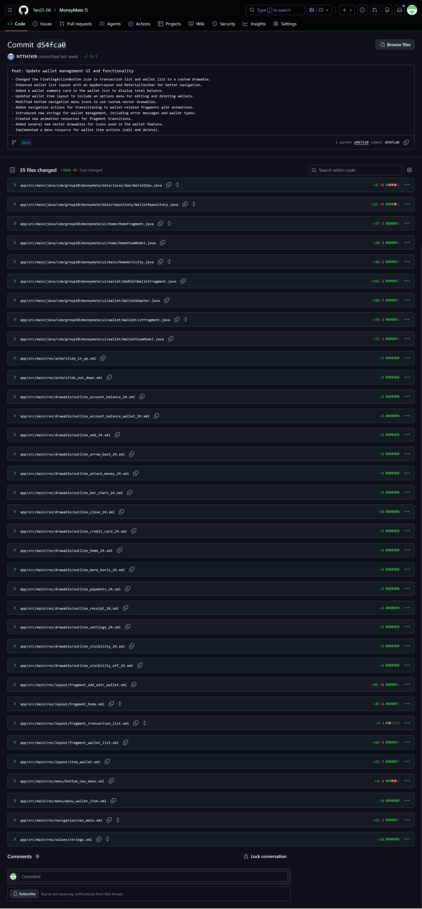

# BÁO CÁO TIẾN ĐỘ TUẦN

## I. Thông Tin Chung

| Thông tin       | Chi tiết                |
|-----------------|-------------------------|
| **Mã nhóm**     | 10                      |
| **Tên nhóm**    | 10                      |
| **Tên dự án**   | MoneyMate               |
| **Thời gian**   | 21/03/2026 - 28/03/2026 |

---

## II. Công Việc Đã Hoàn Thành Trong Tuần

### 23127472 – Phạm Ngọc Thái
- luồng ngân sách chính đã hoàn thành: tạo, chỉnh sửa, xóa, liệt kê, chi tiết
- đã thêm tính năng lọc nhận biết ví cho ngân sách đang chạy và đã hoàn thành
- đã thêm màn hình ngân sách đã hoàn thành với trạng thái bộ lọc ví được bảo toàn
- đã thêm các tab ngân sách cho Tháng này / Tương lai / Thời gian khác
- cải thiện các trạng thái trống bằng CTA và luồng chuyển hướng ưu tiên ví
- đã thêm số liệu thống kê chi tiết ngân sách và cập nhật biểu đồ từ dữ liệu giao dịch trực tiếp
- đã triển khai danh mục ngân sách "Các mục khác" ảo với logic loại trừ động
- khả năng hiển thị ngân sách lịch sử cố định và phân loại ngân sách cuối cùng
- đảm bảo việc xóa ngân sách không xóa các giao dịch liên quan
- tiêu đề ngân sách được đánh bóng, bộ chọn ví và siêu dữ liệu mục ngân sách
- đã cập nhật hỗ trợ điều hướng, giao dịch, ví, danh mục và logic vùng chứa ứng dụng được chia sẻ
- Các lĩnh vực ngoài ngân sách đã chạm tới:
- lọc giao dịch/hỗ trợ kho lưu trữ
- kho danh mục/hỗ trợ dao cho danh mục ảo
- tích hợp luồng thêm/chỉnh sửa ví
- khởi động ứng dụng/kết nối vùng chứa
- chuỗi, màu sắc, điều hướng và định dạng tiền tệ được chia sẻ

---

### 23127499 – Lê Huy Toàn

- nâng cao quản lý giao dịch với chức năng thêm/chỉnh sửa, xác thực và cải tiến giao diện người dùng
- tăng cường luồng đăng ký và đăng nhập với trạng thái tải và gieo hạt danh mục mặc định
- cập nhật phương thức truy cập AppContainer và cải thiện bố cục SettingFragment

**Minh chứng:**

---

### 23127510 – Phùng Ngọc Tuấn

- Đã thay đổi biểu tượng FloatActionButton trong danh sách giao dịch và danh sách ví thành biểu tượng có thể rút tùy chỉnh.
- Bố cục danh sách ví nâng cao với AppBarLayout và MaterialToolbar để điều hướng tốt hơn.
- Đã thêm thẻ tóm tắt ví vào danh sách ví để hiển thị tổng số dư.
- Cập nhật bố cục mục ví để bao gồm menu tùy chọn chỉnh sửa và xóa ví.
- Đã sửa đổi các biểu tượng menu điều hướng phía dưới để sử dụng các vectơ vẽ tùy chỉnh.
- Đã thêm hành động điều hướng để chuyển sang các đoạn liên quan đến ví có hình ảnh động.
- Giới thiệu các chuỗi mới để quản lý ví, bao gồm thông báo lỗi và loại ví.
- Tạo tài nguyên hoạt ảnh mới cho quá trình chuyển đổi phân đoạn.
- Đã thêm một số vectơ vẽ mới cho các biểu tượng được sử dụng trong tính năng ví.
- Đã triển khai tài nguyên menu cho các hành động của mục ví (chỉnh sửa và xóa).

**Minh chứng:**

---

## IV. Kế Hoạch Công Việc Tuần Tới
- Hoàn thành cài đặt Thống kê 
- Hoàn thành cài đặt Setting Profile
- Hoàn thành xây dựng Passcode

---

## V. Các Vấn Đề Phát Sinh

- Các thành viên còn bận với deadline của các môn khác nên chưa thể tập trung hoàn toàn vào dự án, dẫn đến tiến độ có phần chậm hơn so với kế hoạch ban đầu.