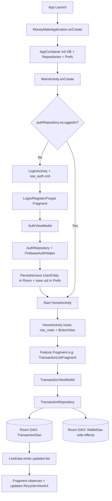

# MoneyMate - High-Level Technical Architecture

## 1. System Architecture

MoneyMate is a single-module Android app (`app/`) organized as **MVVM + Repository + Room + Manual DI**.

- **Entry/Composition**: `MainActivity` routes to auth or home; `MoneyMateApplication` initializes `AppContainer`.
- **DI Layer**: `AppContainer` wires `AppDatabase`, repositories, auth helper, and preferences.
- **UI Layer**: `LoginActivity` hosts `nav_auth.xml`; `HomeActivity` hosts `nav_main.xml` with bottom navigation.
- **ViewModel Layer**: Exposes `LiveData` and UI state for fragments.
- **Repository Layer**: Encapsulates business logic and mediates Room/Firebase access.
- **Data Layer**: Room entities/DAOs as local source of truth; Firebase Auth for authentication.

## 2. Core Components

### Bootstrap and routing
- `MainActivity`: startup router (`LoginActivity` vs `HomeActivity`).
- `MoneyMateApplication`: app-level initialization.
- `AppContainer`: manual dependency container (service locator style).

### Authentication
- `AuthRepository`: login/register/reset flows via `FirebaseAuthHelper` + local user persistence.
- `AuthViewModel`: auth state machine (`IDLE`, `LOADING`, `AUTHENTICATED`, etc.).
- `LoginFragment`, `RegisterFragment`, `ForgotPasswordFragment`: auth UI flow.

### Main shell and navigation
- `HomeActivity`: `NavController` + bottom-nav top-level destination behavior.
- `nav_auth.xml`, `nav_main.xml`: feature navigation graphs.

### Data persistence and business logic
- `AppDatabase`: Room singleton (`version = 7`), 7 entities, 7 DAOs.
- Repositories: `TransactionRepository`, `BudgetRepository`, `WalletRepository`, `CategoryRepository`, etc.
- `TransactionRepository`: special logic to auto-adjust wallet balances for transaction CRUD.

### Feature modules (implemented depth)
- **Strongly implemented**: Transaction, Budget, Wallet, Category, Home, Auth.
- **Scaffold/partial**: Statistics, Profile, Security, AI, parts of Debt/Event.

## 3. Execution Flow

## 4. Data Flow

### Movement path
- UI event (form input/click) -> ViewModel method -> Repository operation -> DAO/Room write -> Room invalidation -> `LiveData` emission -> UI re-render.

### State ownership
- **Persistent domain state**: Room (`users`, `wallets`, `categories`, `transactions`, `budgets`, `debts`, `events`).
- **Session/preferences state**: `PrefsManager` (`uid`, login flags, display settings).
- **Auth state**: FirebaseAuth session wrapped by `FirebaseAuthHelper`.
- **Transient UI state**: Fragment fields + `MutableLiveData` in ViewModels.

### Key behavior
- Writes run on `AppDatabase.databaseWriteExecutor`.
- Soft-delete and sync markers (`is_deleted`, `sync_status`) are used across entities.
- Budget computations aggregate transactions by category/wallet/date ranges.

## 5. Tech Stack

### Platform and language
- Java 11
- Android minSdk 29, target/compileSdk 36
- Gradle Kotlin DSL + Version Catalog

### Core dependencies (from Gradle catalog)
- AndroidX Lifecycle (`ViewModel`, `LiveData`)
- Navigation Component + Safe Args
- Room
- Material Design
- Firebase Auth
- Firebase Firestore (declared)
- WorkManager (declared)
- MPAndroidChart (declared)
- CameraX (declared)
- ML Kit Text Recognition (declared)
- Google Generative AI (Gemini) (declared)
- Biometric (declared)

## Design Patterns Detected

- **MVVM**
- **Repository Pattern**
- **Service Locator / Manual DI** via `AppContainer`
- **Singleton** via `AppDatabase.getInstance(...)`
- **Observer Pattern** via `LiveData`
- **Factory Pattern** via custom `ViewModelProvider.Factory` in budget flows

## Ambiguities and Gaps

- [Ambiguous] Firestore/WorkManager sync pipeline is declared but no concrete sync worker flow found in current Java sources.
- [Ambiguous] AI stack (Gemini/ML Kit/CameraX) dependencies are present, but runtime feature logic is mostly scaffolded.
- [Ambiguous] Security passcode/biometric flow is scaffolded; startup router currently checks only Firebase auth state.
- [Ambiguous] Statistics/Profile modules are placeholders with minimal logic.
- [Ambiguous] Documentation schema and current entities show drift in some fields (for example user sync fields and budget shape).
- [Ambiguous] Soft-delete sync status usage is inconsistent in some DAOs vs `SyncStatus.PENDING_DELETE` constant semantics.

